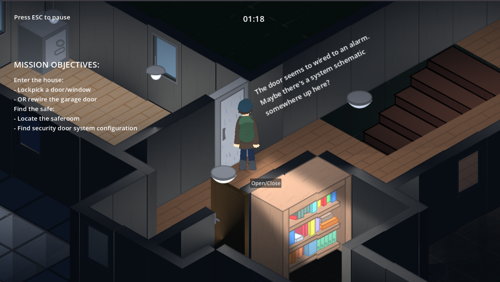
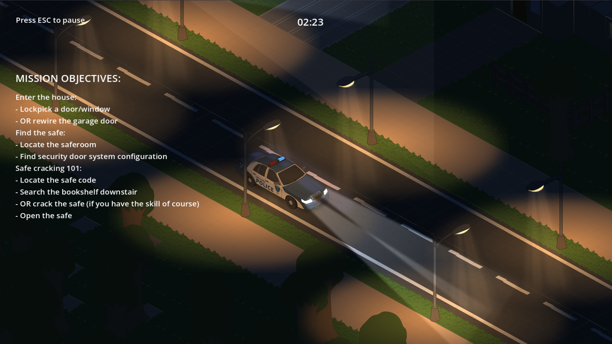
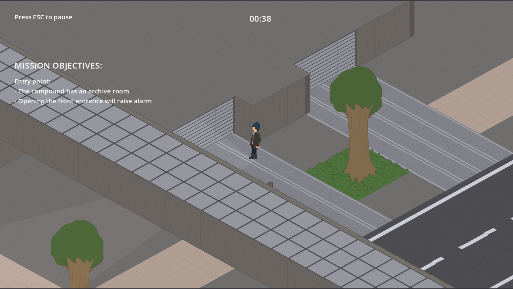
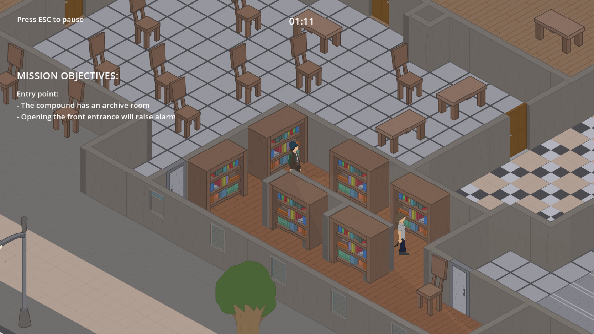

# BREAKING IN

<table>
  <tr>
    <td></td>
    <td></td>
  </tr>
  <tr>
    <td></td>
    <td></td>
  </tr>
</table>  

<i>in-game image</i>

You are a post-graduate master student that just graduated right in a crisis period. Unemployment spiked, everything is expensive and no one is hiring you. You applied to more than hundred companies already, but none of them is hiring you (even small shops!). You are forced to the last resort: attempt burglary

Game is set in the imaginative city of Lavanda, of country United Island.

## INSTALLATION
Click on the Releases section or download from the Exports folder

- Windows: download the BreakingIn.exe  
- Linux: download the BreakingIn.x86_64

## GAME DEMONSTRATION

[Youtube video demonstration](https://www.youtube.com/watch?v=y9ckiLJCxWg)

## SKILLS
### Major skills
- **Mechanical engineer**: Can picklock lock
- **Electrical engineer**: Can rewire some electrical devices
### Minor skills
- **Safe cracking**: Can crack safe without needed to find the code
- **Sabotager**: Can cause short circuit to power box
- **Entry pryer**: Can pry door without leaving it open
- **Athletic**: Can run faster
- **Brute force**: Can knockout people
- **Slow detect**: Securities detect much slower
- **Breaker**: Can kick door or break windows
### Skill demonstration

[Youtube skill demosntration](https://www.youtube.com/watch?v=w6KBidJALFk)

## ITEMS

- **Lockpick kit**: enable to lockpick entries. Required Mechanical Engineer  
- **Multimeter**: tool needed to cause power short circuit. Required Electrical Engineer  
- **Wires x5**: enable to rewire some electrical components. Required Electrical Engineer  
- **Flashlight**: shine lights in dark area  
- **Drill**: enable to breach most entries  
- **Crowbar**: can pry entries
## CONTROLS
- **WASD**: move around
- **Hold RMouse**: look around.
- **T**: Turn on flashlight (need flashlight in inventory)
- **ESC**: Pause the game
- **E/Hold E**: Interact
- **F**: Knockout securities. Must be right behind them and have the necessary skill

## CREDITS

### Texture assets: 
- Everything is made by me

### Music used: 
- Pariah by Scott Buckley – released under CC-BY 4.0. [www.scottbuckley.com.au](https://scottbuckley.com.au) 
- Parasite by Scott Buckley – released under CC-BY 4.0. [www.scottbuckley.com.au](https://scottbuckley.com.au)  
- Contagion by Scott Buckley – released under CC-BY 4.0. [www.scottbuckley.com.au](https://scottbuckley.com.au)  

### SFX used: 
- Every SFX is from the game Project Zomboid. (and yes i have bought the game)  
Thanks to The Indie Stone for creating Project Zomboid, which made this possible. This is an unofficial fan production for non-commercial purposes made under the [Indie Stone Terms (Terms 2.2)](https://projectzomboid.com/blog/support/terms-conditions/)
- Sound Effect by [freesound_community](https://pixabay.com/users/freesound_community-46691455/?utm_source=link-attribution&utm_medium=referral&utm_campaign=music&utm_content=33575) from [Pixabay](https://pixabay.com//?utm_source=link-attribution&utm_medium=referral&utm_campaign=music&utm_content=33575)

## AI USAGE

AI assistance (Gemini) was used for technical understanding, asset licensing information and assists with code debugging. 

## FEATURES IMPLEMENTED

<table width="100%" border="solid">
  <thead>
    <tr>
      <td><b>Feature</td>
      <td><b>Points</td>
      <td><b>Where</td>
    </tr>
  </thead>
  <tbody>
    <tr>
      <td>The game can be played, it does not crash, the player does not get stuck, etc.</td>
      <td>2</td>
      <td>In-game</td>
    </tr>
    <tr>
      <td>The game has consistent and coherent visual look</td>
      <td>2</td>
      <td>Assets all by me</td>
    </tr>
    <tr>
      <td>The music and sound effects are in balance</td>
      <td>2</td>
      <td>In-game</td>
    </tr>
    <tr>
      <td>The game has setting screen, where gamer can customize settings (e.g. music and sfx volume)</td>
      <td>2</td>
      <td>Pause menu or Main menu</td>
    </tr>
    <tr>
      <td>The game has dynamic lightning (i.e. the lightning varies on different areas / times of the game)</td>
      <td>3</td>
      <td>Different levels has different lightnings conditions</td>
    </tr>
    <tr>
      <td>The game has enemies that can be destroyed</td>
      <td>2</td>
      <td>The securities can be knockout only if player has the skill "Brute force"</td>
    </tr>
    <tr>
      <td>The enemies have “some intelligence” (state machine is enough)</td>
      <td>3</td>
      <td>In Security scene, there's a StateMachine with various StateNode</td>
    </tr>
    <tr>
      <td>There are some collectable items in the game (e.g. coins, ammo, guns, starts…)</td>
      <td>1</td>
      <td>The player need to collect the money in order to gain exp</td>
    </tr>
    <tr>
      <td>The game area is bigger than just one screen</td>
      <td>1</td>
      <td>In-game</td>
    </tr>
    <tr>
      <td>There are different menu and game scenes</td>
      <td>1</td>
      <td>The game itself</td>
    </tr>
    <tr>
      <td>There are various maps with increasing difficulty</td>
      <td>2</td>
      <td>The intel is much harder than The rookie</td>
    </tr>
    <tr>
      <td>Gamer can see how fast/good she passes the level/map</td>
      <td>1</td>
      <td>The elapsed time in-game</td>
    </tr>
    <tr>
      <td>All the settings and game records (high score / TOP10, passed levels, etc) are stored in a save file(s)</td>
      <td>2</td>
      <td>player_stat.json and settings.json in Godot system files (godot/app_userdata/Breaking in/)</td>
    </tr>
    <tr>
      <td>Gamer can see how fast/good she passes the level/map</td>
      <td>1</td>
      <td>The elapsed time in-game</td>
    </tr>
    <tr>
      <td>Finishing something (eg. a map) unlocks something else (e.g. another map)</td>
      <td>2</td>
      <td>Finishing The Rookie will unlock The intel</td>
    </tr>
    <tr>
      <td>Shader effects are used to improve the visual style and immersion</td>
      <td>1</td>
      <td>The lightpole beam and exfiltrate boundary</td>
    </tr>
    <tr>
      <td>The game has a real story unfolding while the gamer advances in the game</td>
      <td>2</td>
      <td>The mission description itself and the archive files found in-game</td>
    </tr>
    <tr>
      <td>Physics engine is used in innovative way (e.g. there are areas where the gravity changes or some enemies have reversed gravity, etc)</td>
      <td>1</td>
      <td>The lockpick pins</td>
    </tr>
    <tr>
      <td>Music adapts to game situations (e.g. the health level is lower, music is more intensive)</td>
      <td>2</td>
      <td>Music changes when police is arriving</td>
    </tr>
    <tr>
      <td>Effective use of light masks</td>
      <td>3</td>
      <td>the vision cone in the game that does not render selected object if it’s not in the cone, walls will block the cone, and any other object that is outside the cone will not be rendered</td>
    </tr>
    <tr>
      <td>Game effectively uses TileMapLayer and TileSet for isometric game</td>
      <td>3</td>
      <td>
      <ul>
        <li>Dynamically spawn interactive options for certain cells (door, window, safe, …)</li>
        <li>Switching layers when entering new floor</li>
        <li>Certain floors will become transparent when entering a new one</li>
        <li>Utilise custom data to control cell state and game progression (turn lights on/off, open window, …)</li>
      </ul>
</td>
    </tr>
    <tr>
      <td>Total:</td>
      <td>39</td>
      <td></td>
    </tr>
  </tbody>
</table> 

## ORIGINAL PROJECT PLAN

[Google doc link](https://docs.google.com/document/d/1GaDC33eiULkoyTu2QSh_gFuNoM83-M_0nhaqNIjCJ2Q/edit?usp=sharing)